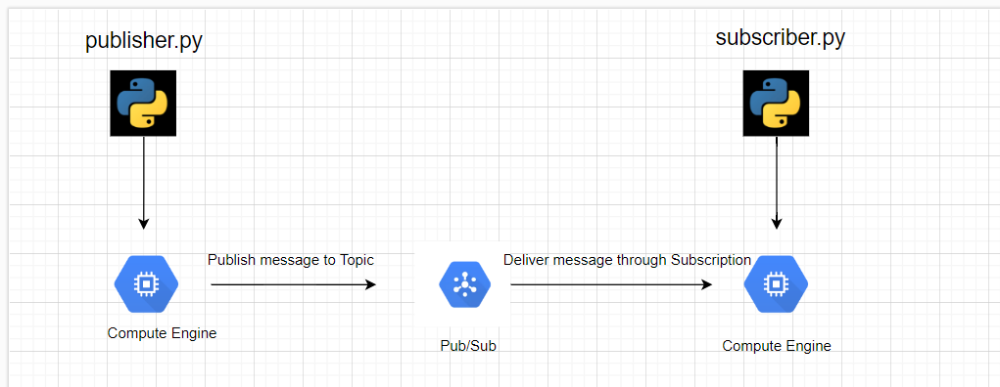
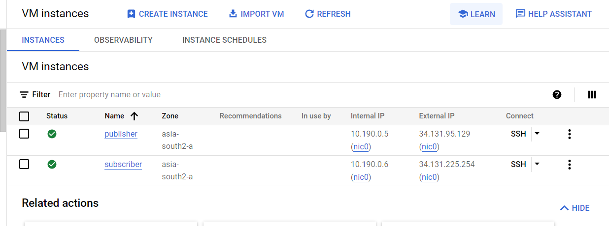
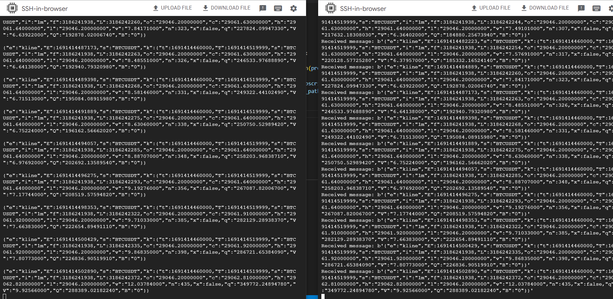

# Pub/Sub

First, the receive_data topic was created on Google Cloud for Pub/Sub. After that, Google Cloud automatically creates the subscription. receive_data-sub was created automatically after this action.

Two virtual machines running on two Compute Engine instances were created. The virtual machines used Debian GNU/Linux 11 as the operating system. The N1 series machines were chosen due to their cost-effectiveness. Since these machines and the appropriate operating system were not available in Europe and America, the region was set as Asia. Python was already pre-installed on the machines. The VM was updated using the 'sudo apt-get update' command to utilize the latest versions of the packages. This was done to ensure the use of the most up-to-date versions of these packages. The 'pip' package was not initially installed on the VM, so 'pip' was installed first, followed by the installation of the 'websocket' and 'pubsub' libraries.

The 'publisher.py' script is running on the publisher machine, while the 'subscriber.py' script is running on the subscriber machine. The 'publisher.py' script uses a WebSocket connection to fetch real-time 1-minute data for the BTCUSD coin from the Binance API. This real-time data retrieval process utilizes the WebSocket protocol. The fetched data is then sent to a created topic. 
Publishes the incoming data over the topic.

The "subscriber.py" script listens to messages from a topic and receives incoming messages, then prints them to the screen. These two scripts are running on two different machines. First, on the initial virtual machine, the "publisher.py" script is executed, sending real-time data to the topic. Subsequently, on the other machine, the "subscriber.py" script is executed, and it receives the real-time data. This way, real-time data communication is established between the two different machines. When we stop the operation of the initial virtual machine, i.e., when we halt the execution of the "publisher.py" script, real-time data transmission comes to an end.

